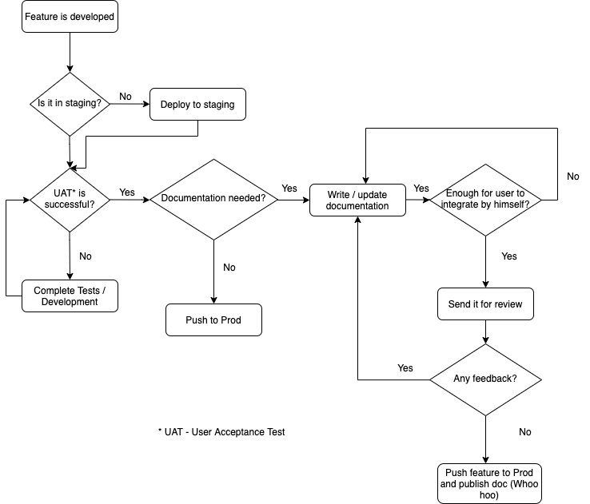
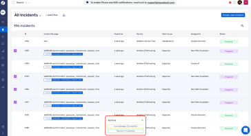
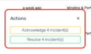
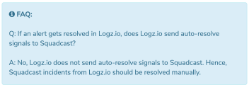
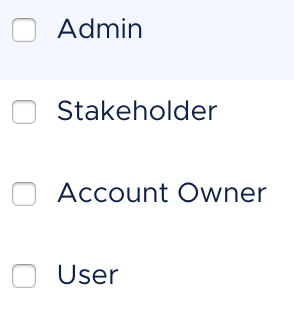

Squadcast Documentation

## Architecture

```text
    - Root
        - _data
            - sidebars
                - mydoc_sidebar.yml ( left hand side navigation panel )
            - tags.yml ( allowed tags, used for related docs )
            - topnav.yml ( navigation bar )
        - _includes
            - feedback.html
            - footer.html ( footer template )
            - head.html ( head template )
            - sidebar.html ( sidebar template )
            - topnav.html ( navbar template )
        - _layouts
            - page.html ( page template )
        - _site ( contains generated files )
        - docs
            - images ( images/screenshots for the docs )
        - images ( images/screenshots for the homepage )
        - pages 
            - mydoc ( contains the .md files )
        - _config.yml ( configuration file )
        - 404.md
        - index.html ( homepage )
```

## Local Server

1. Comment out `url: SquadcastHub` and `baseurl: /squadcasthub.github.io` in `_config.yml`
2. Execute `bundle exec jekyll serve`
3. Executes on localhost port `4000`

## Before commit & push

1. We dont't have a CI/CD enabled for this, and the serving is done from the Repo directly.
2. So the pages need to be generated before `git commit`.
3. To generate the pages, run `bundle exec jekyll build`.
4. To test the page layouts and serve paths for the documentation, use `bundle exec jekyll serve` and visit http://localhost:4000
5. Always rebase/checkout a branch from master, because page generation can override some unmerged commits from the local development branch or unupdated branch. And of course merging is going to be painful.

```shell
## Go to the latest production branch
git checkout main
## Pull the latest version of that brach from remote
git pull
## Base a new branch out from this latest prod branch
git checkout -b FEATURE_NAME_1
```

## Squadcast: Documentation Writing Guidelines

This document will walk you through the Do’s and Don’ts of documentation writing and will prove to be useful in case of text-formatting, capturing screenshots, branding and icon usage doubts. 

### Goals: 

- Understand how to make documentations easier to understand
- Understand how to correctly represent the brand and the features of the product
- Understanding icon usage in places where we’re describing a UI element 
- Understanding how to make screenshots more effective with the help of annotations, arrows, etc.
- Text-formatting - Do’s and Don’ts 

### Where does writing documentation come in the feature development process? 



### Formats, Structures & Guidelines

- [Alert Source Integration Guidelines](https://github.com/SquadcastHub/ingester/blob/master/docs/manifests.md)
- [Documentation Structures used today](https://docs.google.com/document/d/1IcJDC_OpkwpPu99eYFrVtVY5rfxun28x6rL3ncEnqq0/edit#heading=h.4djkeem2h2ad) 
- [How to use Jekyll for Documentation?](https://docs.google.com/document/d/1U4wMNGeNWD6HyLzxpyMSALVl_DDNqdd1ylNClYrQvp0/edit?ts=60127c9f#heading=h.63sxi9s93rw9)
- [MD syntax guide](https://www.markdownguide.org/basic-syntax/)

### What to keep in mind while writing documentation? 

- Always use American English. 
- Steer clear of binary pronouns. Use. `they/ them` or `you` wherever necessary. (Always aim to be politically correct. When in doubt, ask yourself if Liz Fong-Jones would be okay if she read that sentence.) 
- We use Markdown format. Indicate Markdown for headings, titles, sub-headings clearly in the doc. 
    - Main Header - ##
    - Sub Headers - ### 
    - Adding a NOTE - ### 
- Use a Note/call-out to add in details or need-to-knows for the user relevant with the documentation. Use judgement to decide if it needs to be titled as a warning, information, good-to-know, important, etc.
- Headings generally do not end with ":"; if you decide to add ":" at the end of a heading, ensure it is present at the end of each heading. 
- Entities must begin with a capital letter. 
    - Eg: it is not **escalation policy**, it is **Escalation Policy**
    - Eg: it is not **service**, it is **Service**
- Steps in a section are marked by numbers (1,2,3,4...). Sub-steps within a step can be marked by indented alphabets in brackets (a,b,c... / i, ii, iii...).
- Within steps in the setup procedure, do not add fullstops; otherwise, fullstops can be added to other sentences within the doc. If you want to add fullstops everywhere (including steps), then ensure every step has a fullstop, **maintain consistency**.
- While annotating screenshots, either use **red** squared rectangles throughout or rounded rectangles throughout - not a mix of both as far as possible. 
- While capturing screenshots, let us try to get a bigger portion of the screen rather than the exact entity and within that screenshot, let us highlight what our users must be exactly looking at, of course - by using our judgement.

- DO THIS: 

- DON'T DO THIS 

- While using rectangular boxes, highlight only what you want to show, do not highlight half the page where the subject occupies only 1/10th the box you have drawn
- While mentioning entities in the sentence before the screenshot in which they are highlighted/annotated, mention them in bold, not add them in "" or italics.
    - Eg: Use `Navigate to Services` instead of `Navigate to "Services"`. 
- Ensure words are used in the same way throughout the doc.
    - Eg: **setup** is used as setup throughout and not **set-up**, **drop-down** is used as drop-down throughout and not **dropdown**
- Understand where, what words are most suited; "enabled" does not make sense everywhere, "created", similarly, does not make sense everywhere.
    - Eg: "Your Slack integration is now enabled" instead of "Your Slack integration is now created". 
- Do not repeat the words - "now", "also", "next" in every step under procedure. It is understood that next step would mean they would have to do it "next". 
- Differentiate between what information needs to be added where and how. This helps our document to be more effective. Having everything written in the same way does not grab the user's attention to the important points. Some different content types could be: 
    - **A step** within the procedure
    - Something that needs to be mentioned in a separate paragraph **after a step** (indicating that it is not a "step")
    - Something that needs to be added **as a call-out** (warning, note, information, important, etc.)
        - Eg: "That is it, you are now good to go! Your setup is complete." **is NOT a step** in the procedure. It is a separate sentence, indicating the steps in the procedure are complete. 
- Add hyperlinks to other locations within our support doc where applicable; users should not have to search aimlessly and give up at the end of it all. 
    - Eg: You can either choose to use existing Services or [create a new Service](https://support.squadcast.com/docs/adding-a-service-1)
- Do not use the terms "alerts" and "incidents" interchangeably - let us **maintain uniformity throughout the document** (unless required).
- Use full product and feature names where feasible, rather than abbreviating them.
    - Eg: Use Squadcast Actions instead of just Actions
    - Eg: Use Incident Timeline instead of just Timeline 
- While writing the names of external product or brands, use the full name as is marketed by them
    - Eg: Use Sysdig Monitor instead of just Sysdig
    - Eg: Use Opsgenie instead of OpsGenie
    - Eg: Use PagerDuty instead of Pagerduty
    - Eg: Use HetrixTools and not hetrixtools or Hetrixtools
- Always start the documentation with a feature introduction 
    - Start the documentation with what is expected out of the feature you are describing 
        - Eg: Incident Notes enable you to add important notes that can help mitigate an incident faster. You can use this to:
            - Collaborate with your team and resolve the incident
            - Use it to store important pointers that will help with the mitigation
            - Use it to store Notes that can be populated in the Postmortem report
            - Share Organization-wide information like resolution reason, Follow-up Tasks, etc.
    - For Alert Source Docs - start with a small one-liner description of the tool and hyperlink the tool name with the tool's website.
        - Eg: [Bugsnag](https://www.bugsnag.com/) is an error monitoring and reporting software with best-in-class functionality for mobile apps notifying users of bugs, errors & more. Route detailed error alerts from Bugsnag to the right users in Squadcast.
    - State explicitly if it is bidirectional 
    - Add a section of expected FAQs that will help them handle their own support.
        - Eg: 
- **Consistency throughout is key - we must proof-read the entire doc and be super critical of every little thing**

### Product and Feature Names: 

Note that this list is not exhaustive. For more information, you can check out our [Glossary](https://support.squadcast.com/docs/glossary). 

- Squadcast 
- Account Owner 
- Admin
- User
- Squads
- Escalation Policy 
- Services
- StatusPage 
- Schedules 
- Squadcast Actions 
- Incident Timeline 
- Incident List
- Incident Dashboard
- Incident Details Page
- Incident Notes 
- Alert Source Integration 
- Extensions
- Analytics
- User Profile
- My Profile

### Commonly used words and terminologies: 

Note that this list is not exhaustive. Feel free to add in other terminologies that come into our use-case. 

- **Check**: Don’t use ‘check’ to refer to marking a check box. Use `select` or `mark`. 
    - Ex: **Select** `Repeats` to ensure that the schedules are recurring
- **Clear**: Don’t use ‘check’ to refer to un-marking a check box
    - Ex: **Clear** `Repeats` to ensure that it is a one-time schedule only. 
- **Click here**: Don’t just use ‘click here’ and hyperlink it. Instead, use ‘For more information on XYZ, see &lt;Add link to a small description&gt;
    - Ex: To know more about how we’re better than Pagerduty, check out our [Pagerduty Alternative page](https://www.squadcast.com/pagerduty-alternative).
- **Select**: Use to describe choosing an item from among multiple options, selecting text, or marking a checkbox.
- Using **fill in; fill out** : Use _fill in_ when referring to entering information in individual fields. Use _fill out_ when referring to completing an entire form.
- Using **Markdown**: Always capitalized and in full. Use Markdown instead of MD. 
- Using **mobile, mobile device, mobile phone**: Use one of these terms instead of **cell phone**.
- Use **on-premise; not on prem** or **on premise**
- Use **regular expression** instead of **regex**
- **screenshot (noun); not screen shot or screensnap**
- **URL**: All caps. Plural is _URLs_.
- **Webhook**: Capitalize.

### Describing UI elements and Icons: 

- Navigation Sidebar : 

- More Options Icon: 

- Settings Icon: 

- My Profile Icon: 

- Toggle : 

- Download Icon: 

- Delete / Deactivate Icon: 

- Checkbox: 

- Dropdown: 

- Add: 

- Edit:  (or) 

- Search Bar: 

- Text box: 